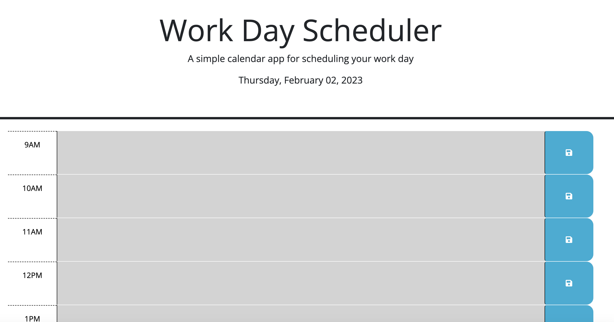

# Work Day Scheduler

## Description

This week's challenge allows us to utilize our Third-Party API skills to work with a starter code that allows a user to save events for each hour of the working day. This starter code uses the Day.js library to work with date and time.  

See below for the direct link to the live page:

[Live Link to Deployed Application](https://linhntran.github.io/work-day-scheduler/)

The following image demonstrates what the web application looks like once the user navigates to the live page. 

